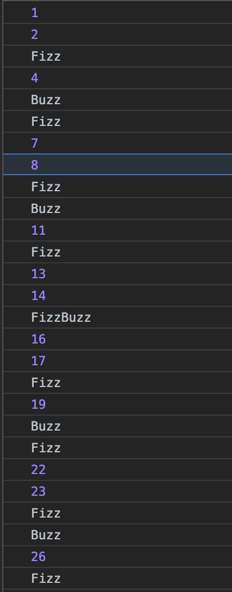

# レッスン2

## 課題1

変数countを宣言し、0で初期化します。  
while文を使って、countを1ずつ増やして出力することを100になるまで繰り返すコードを書いてみましょう。

[答え](samples/lesson02-01.html)


## 課題2

課題1のコードをfor文を使って書き換えましょう。

[答え](samples/lesson02-02.html)

## 課題3

定数numを宣言し、4で初期化します。  
numの値が偶数か奇数かを調べて、偶数なら「偶数です」と表示、奇数なら「奇数です」と表示しましょう。  
（「偶数です」と表示されるはずです）

### ヒント

2で割り切れるかを調べるには、あまりを計算する「%」演算子を使うといいでしょう。

[答え](samples/lesson02-03.html)

## 課題4

定数numを宣言し、0から99のランダムな数字で初期化します。

テンプレートリテラルを使って、

```
56は偶数です
```

のように表示しましょう。

###  ヒント

0以上x未満のランダムな数字を生成し、定数numに代入するコードは、

```javascript
const num = Math.floor(Math.random() * 100);
```
です。

## 課題5

定数diceを宣言し、1〜6のランダムな数字で初期化します。

diceの値が偶数か奇数かを調べて、

```
2は偶数です
```

```
5は奇数です
```

のように表示しましょう。

リロードすると、ランダムな数字が再度取得されるので、結果が変わります。  
何度かリロードして、期待通りの結果になっているかを確認しましょう。

### ヒント

1〜6のランダムな数字を取得するには、まず0〜5のランダムな数字を取得し、それに1を足すといいでしょう。

[答え](samples/lesson02-05.html)

## 課題6

定数yourDiceを宣言し、1〜6のランダムな数字で初期化します。  
定数enemysDiceを宣言し、1〜6のランダムな数字で初期化します。

コンソールにyourDiceとenemysDiceの値を表示した後、勝敗の結果を表示ます。  
勝敗は、サイコロの目の大きい方が勝ち、同じ場合は引き分けとします。

リロードすると値や結果が変わります。

出力例1

```
あなたの目： 3
敵の目： 6
あなたの負け
```
出力例2

```
あなたの目： 5
敵の目： 1
あなたの勝ち
```
出力例3

```
あなたの目： 4
敵の目： 4
引き分け
```

[答え](samples/lesson02-06.html)

## 課題7

1から100までの数字を、順に以下のように出力してください。

1. 3で割り切れるときはFizzと表示する
2. 5で割り切れるときはBuzzと表示する
3. 3でも5でも割り切れるときはFizzBuzzと表示する
4. 3でも5でも割り切れないときはそのままの数字を出力する

出力例


[答え](samples/lesson02-07.html)
