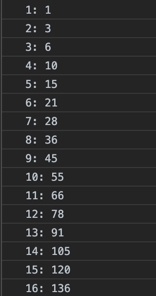
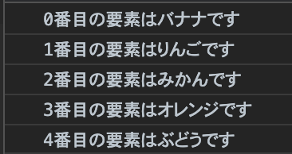
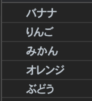
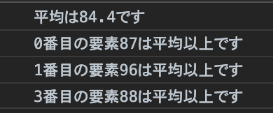

# レッスン3: 配列とループ

## 課題1

1 + 2 + 3 + 4 + ・・・と順に足していき、和がはじめて1000を超えるときの足した数字とその和を求めましょう。  
途中の和もコンソールに表示してください。

出力例  



### ヒント

足す数を変数num、和を変数sumに覚えておき、

1. numを1ずつ増やす
2. sumにnumを足す
3. 表示する

を繰り返すといいでしょう。

[答え](samples/lesson03/lesson03-01.html)

## 課題2

以下のように配列を宣言し、3番目の要素をコンソールに表示してください。

```javascript
const array = ['バナナ', 'りんご', 'みかん', 'オレンジ', 'ぶどう'];
```

出力例

```
3番目の要素はオレンジです
```

[答え](samples/lesson03/lesson03-02.html)

## 課題3

以下のように配列を宣言し、ランダムな要素をコンソールに表示してください。

```javascript
const array = ['バナナ', 'りんご', 'みかん', 'オレンジ', 'ぶどう'];
```

出力例

```
2番目の要素はみかんです
```

[答え](samples/lesson03/lesson03-03.html)

### ヒント

課題2の「〜番目」の部分をランダムな定数indexにしてみましょう。

## 課題4

以下のように配列を宣言し、すべての要素を順にコンソールに表示してください。

```javascript
const array = ['バナナ', 'りんご', 'みかん', 'オレンジ', 'ぶどう'];
```

出力例  


[答え](samples/lesson03/lesson03-04.html)

## 課題5

以下のように配列を宣言し、すべての要素を順にコンソールに表示してください。  
ただし、for...of 文を使って配列から各要素を取り出してください。

参考資料: [for...of文について](https://developer.mozilla.org/ja/docs/Web/JavaScript/Reference/Statements/for...of)

```javascript
const array = ['バナナ', 'りんご', 'みかん', 'オレンジ', 'ぶどう'];
```

出力例  


[答え](samples/lesson03/lesson03-05.html)

## 課題6

以下のように配列を宣言し、配列内の数字の平均を求めましょう。

```javascript
const array = [87, 96, 72, 88, 79];
```

出力例

```
平均は84.4です
```

### ヒント

変数sumを用意し、各要素を順に足していくと、最終的にsumは全要素の合計になります。

[答え](samples/lesson03/lesson03-06.html)

## 課題7

以下のように配列を宣言し、配列内の数字の平均を求めた上で、平均以上の要素を出力しましょう。

```javascript
const array = [87, 96, 72, 88, 79];
```

出力例  


### ヒント

計算した平均値を定数averageに格納し、各要素と大小を比較してみましょう。

[答え](samples/lesson03/lesson03-07.html)
