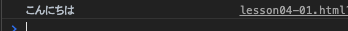
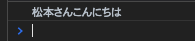
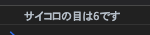
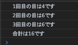
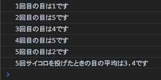
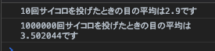
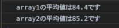
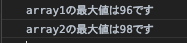
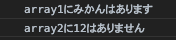
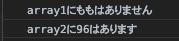

# レッスン4

## 課題1
「こんにちは」と出力する関数`sayHello`を定義し、呼び出しましょう。

出力例


[答え](samples/lesson04/lesson04-01.html)

## 課題2
名前`name`を引数にとり、「〇〇さんこんにちは」と出力する関数`sayHelloTo`を定義し、呼び出しましょう。

出力例  
`sayHelloTo('松本');`の実行結果  


[答え](samples/lesson04/lesson04-02.html)

## 課題3

1. サイコロの目(1〜6)をランダムに返す関数`dice`を定義しましょう。引数はありません。
2. 呼び出してサイコロの目を表示しましょう。
3. consoleへの出力は呼び出し側でします。dice内ではしません。

出力例  


[答え](samples/lesson04/lesson04-03.html)

## 課題4

1. 課題3の関数`dice`の定義をコピーして貼り付けます。
2. `dice`を使って3回サイコロを振り、3回の目の合計値を出しましょう。

出力例  


### ヒント

1. for文を使って、iを(0ではなく)1から3まで繰り返してみましょう。
2. 合計値を入れる変数はsumとするといいでしょう。平均を計算したときのような手順です。

[答え](samples/lesson04/lesson04-04.html)

## 課題5

1. 課題3の関数`dice`の定義をコピーして貼り付けます。
2. `dice`を使って5回サイコロを振り、5回の目の平均値を出しましょう。

出力例  


[答え](samples/lesson04/lesson04-05.html)

## 課題6

1. 課題3の関数`dice`の定義をコピーして貼り付けます。
2. `dice`を使ってn回サイコロを振り、n回の目の平均値を出す関数`diceAverage`を定義しましょう。
3. `diceAverage(10)`と`diceAverage(1000000)`を呼び出してみましょう。

出力例  


### ヒント

1. 関数の中で関数を呼び出してもいいです。`diceAverage`の中で`dice`を呼び出しましょう。
2. 1000000回もconsole出力するとブラウザが固まってしまうので、`diceAverage`は平均のみ出力するようにします。

[答え](samples/lesson04/lesson04-06.html)

ちなみに・・・、試行回数nが増えるほど、平均値はサイコロの目の期待値である3.5に近い数字が安定して出るようになります。

## 課題7

1. 引数`array`で与えられた配列内の数字の平均を求める関数`arrayAverage`を定義しましょう。
2. 以下の2つの配列を作成し、それぞれを`arrayAverage`の引数にして呼び出しましょう。
3. 呼び出した結果を表示しましょう。

```javascript
const array1 = [87, 96, 72, 88, 79];
const array2 = [58, 91, 98, 96, 83];
```

出力例  


[答え](samples/lesson04/lesson04-07.html)

## 課題8

1. 引数`array`で与えられた配列内の数字で最大のものを求める関数`max`を定義しましょう。
2. 以下の2つの配列を作成し、それぞれを`max`の引数にして呼び出しましょう。
3. 呼び出した結果を表示しましょう。

```javascript
const array1 = [87, 96, 72, 88, 79];
const array2 = [58, 91, 98, 96, 83];
```

出力例  


[答え](samples/lesson04/lesson04-08.html)

## 課題9

1. 第1引数`array`で与えられた配列内に第2引数`target`で与えられた要素と一致するものあるかを調べる関数`find`を定義しましょう。
2. 返り値は「あります」か「ありません」の文字のどちらかを返すようにしましょう。
3. 以下の2つの配列を作成し、それぞれを`find`の第1引数にして呼び出しましょう。第2引数は好きなものにしてください。
4. 呼び出した結果を表示しましょう。

```javascript
const array1 = ['バナナ', 'りんご', 'みかん', 'オレンジ', 'ぶどう'];
const array2 = [58, 91, 98, 96, 83];
```

出力例  
  


### ヒント

returnが実行されると、その関数はそこで処理をやめて、値を返します。  
一つでも一致するものが見つかったら、その時点でreturnするといいですね。

[答え](samples/lesson04/lesson04-09.html)

## 課題10

課題9の`find`は文字を返しましたが、`true`や`false`を返したほうが一般的です。  
見つけたら`true`、見つからなかったら`false`を返すように変更しましょう。  
呼び出す側でif文を使い、「あります」か「ありません」を表示するようにしましょう。

```javascript
const array1 = ['バナナ', 'りんご', 'みかん', 'オレンジ', 'ぶどう'];
const array2 = [58, 91, 98, 96, 83];

const findString = 'もも';
const findNumber = 58;
```

出力例  
  


[答え](samples/lesson04/lesson04-10.html)
