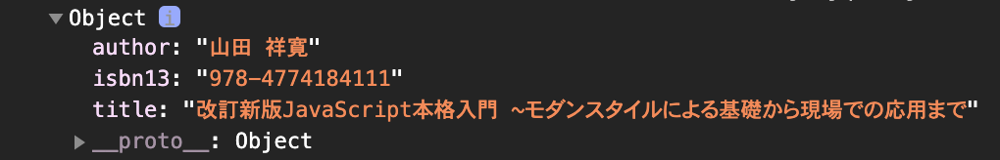
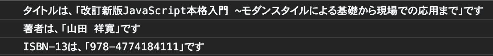
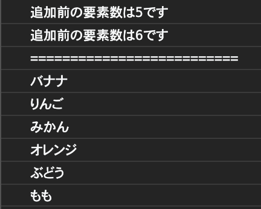
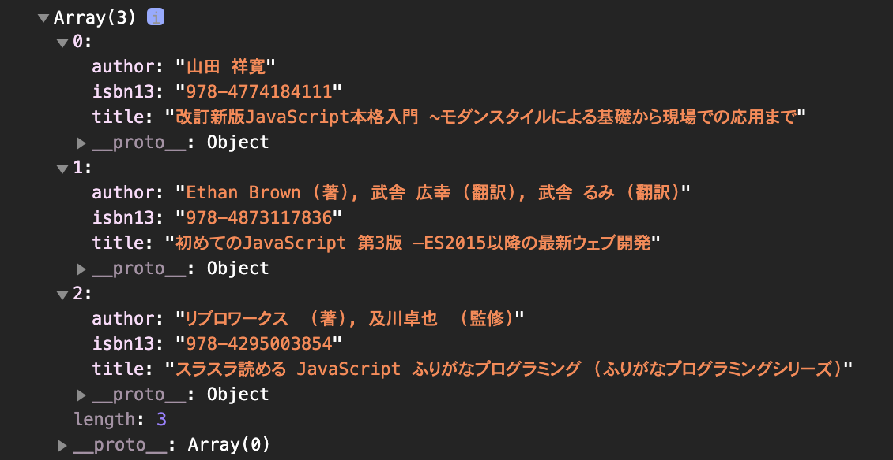
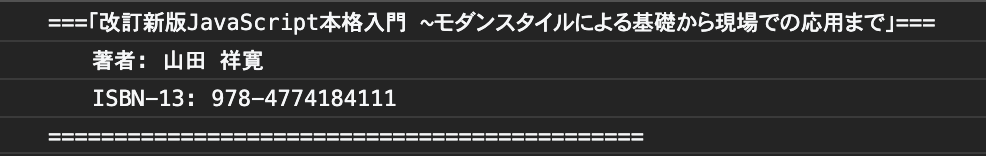
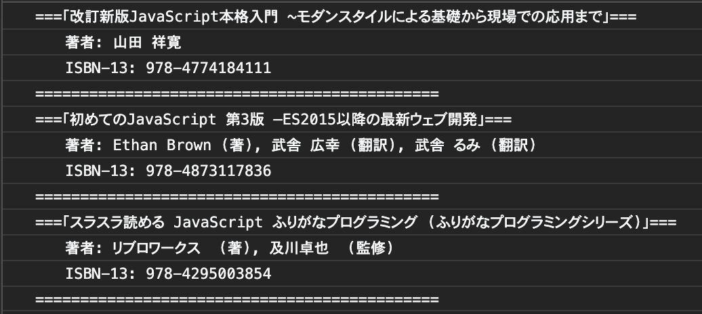
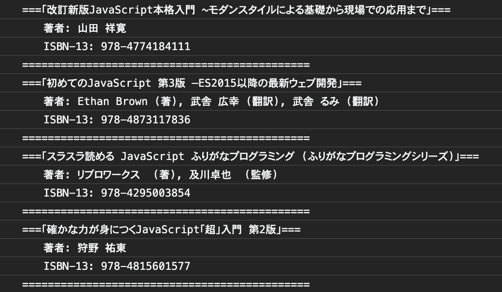

# レッスン5: オブジェクト

## 課題1

本を表すオブジェクト`book`を次の要件を満たすように作成しましょう。

1. `book`は、`isbn13`と`title`と`author`をプロパティとしてもっています。
2. [このリンク](https://www.amazon.co.jp/dp/477418411X/ref=cm_sw_em_r_mt_dp_xCRzFbDZEE4EB)の本の情報を使います。
3. `book`をコンソールに出力してみましょう。

出力例  
  


### ヒント

配列やオブジェクトをそのままコンソールに表示すると、畳まれた状態で表示されるので、中身を確認するときは「▶」をクリックして展開しましょう。

[答え](samples/lesson05/lesson05-01.html)

## 課題2

課題1で作った`book`オブジェクトをコピーして貼り付け、プロパティごとに別々に出力しましょう。

出力例  


[答え](samples/lesson05/lesson05-02.html)

## 課題3

今まで「配列」として使っていたものは、javascriptの中ではArrayオブジェクトとして扱われています。  
Arrayオブジェクトは、javascriptに標準で用意されたオブジェクトです。  
様々なプロパティ、メソッドが予めセットされていますが、その中でも`length`プロパティと`push`メソッドは頻繁に使います。

次のような配列（Arrayオブジェクト）を定義します。

```
const arrayObject = ['バナナ', 'りんご', 'みかん', 'オレンジ', 'ぶどう'];
```

以下の操作を順に行うコードを書いてみましょう。

1. 配列の要素数を表示しましょう。
2. `push`メソッドを使って要素`もも`を追加しましょう。
3. 追加後の配列の長さを出力しましょう。
4. 配列の中身を順にすべて表示しましょう。

出力例  


### ヒント

1. 配列の要素数は`length`プロパティにセットされています。
2. `push`メソッドは、引数に追加したい要素をとり、配列の最後に要素を追加します。

[答え](samples/lesson05/lesson05-03.html)

## 課題4

本を表すオブジェクトの配列`books`を次の要件を満たすように作成しましょう。

1. 本を表すオブジェクトは、`isbn13`と`title`と`author`をプロパティとしてもっています。
2. インターネットで適当な本を3冊検索して、それぞれの本のデータとして使ってください。
3. `books`をコンソールに出力してみましょう。

出力例  
  


### ヒント

1. 配列の要素にオブジェクトを使うときは、`[オブジェクト1, オブジェクト2, ...]`というふうに書きます。
2. オブジェクトは`{プロパティ名1: プロパティの値1, プロパティ名2: プロパティの値2, ...}`というふうに書きます。
3. 1行で書くと横に長くなるので、適切なインデントをつけて複数行で書きます。
4. コードを途中で改行しても、PCの中では、セミコロンまでを1行として認識されます。

[答え](samples/lesson05/lesson05-04.html)

## 課題5

関数の引数にはオブジェクトを渡すこともできます。

1. 引数として本を表すオブジェクトを受け取り、その詳細を表示する関数`dispBookDetail`を定義しましょう。
2. 課題1の`book`オブジェクトをコピーして、`dispBookDetail`の引数にして呼び出しましょう。

出力例  


[答え](samples/lesson05/lesson05-05.html)

## 課題6

課題4で作った`books`配列の中の本を、課題5で作った`dispBookDetail`関数を使ってすべて表示しましょう。  
`books`や`dispBookDetail`の定義はそれぞれからコピペしてください。

出力例  


[答え](samples/lesson05/lesson05-06.html)

## 課題7

関数の引数としてオブジェクトを渡せることは、先に学びました。  
もちろん、Arrayオブジェクトのメソッド`push`の引数にオブジェクトを渡すこともできます。

1. pushメソッドを使って、課題4で作った`books`配列に新しい本を1冊追加してみましょう。
2. 追加後の`books`配列の中身を`dispBookDetail`を使って出力しましょう。
3. `books`や`dispBookDetail`の定義はそれぞれからコピペしてください。

出力例  


[答え](samples/lesson05/lesson05-07.html)
