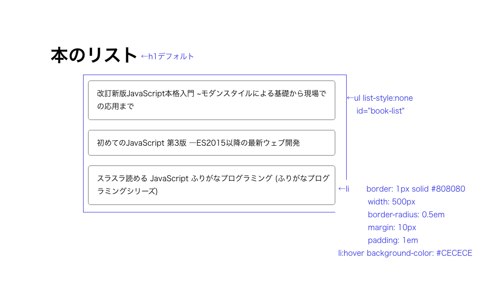
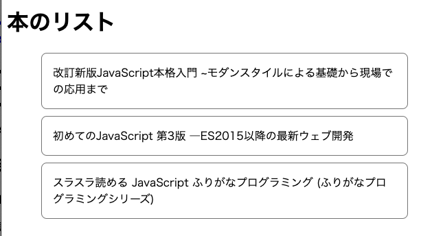
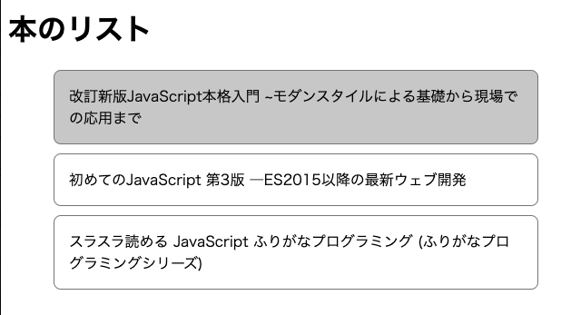
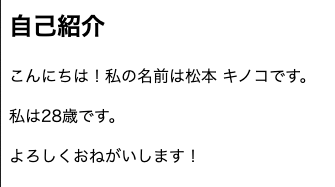
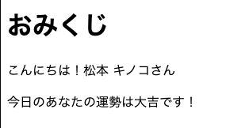
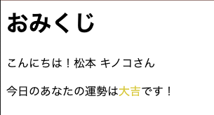
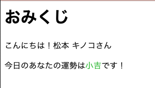

# レッスン6: HTMLとDOM

## 課題1

出力例のような表示になるように、HTMLを書きましょう。  
※ この課題ではjavascriptは書きません。

仕様は以下の通りです。

* CSSはHTMLファイル内に`<style>`タグを用いて記述する
* h1, ul, liを使う
* h1はデフォルト
* ulにはid「book-list」を振り、cssはそのidを使って指定する
* liは枠線を引き（画像参照）、マウスオーバーで背景色を変える

参考画像  


出力例  
  


[答え](samples/lesson06/lesson06-01.html)

## 課題2

下のようなオブジェクト定数`self`を定義して、自己紹介を表示するHTMLを作ってみましょう。

```javascript
```javascript
const self = {
    unsei: '松本 キノコ',
    age: 28
};
```

出力例  


[答え](samples/lesson06/lesson06-02.html)

## 課題3

おみくじを作りましょう。

* おみくじは「大吉、中吉、小吉、凶、大凶」の5種類あります。
* [switch-case文](https://www.javadrive.jp/javascript/if/index4.html)を使って、結果を振り分けてください。
* 名前もjavascriptを使って出力してみましょう。

出力例  


[答え](samples/lesson06/lesson06-03.html)

## 課題4

課題3のおみくじをswitch-case文やif文を使わずに書いてみましょう。  
配列からランダムに1つの要素を選ぶことで、「大吉」や「小吉」などをランダムに出力することができます。

使う配列は以下です。

```javascript
const unseis = ['大吉', '中吉', '小吉', '凶', '大凶'];
```

出力例  


[答え](samples/lesson06/lesson06-04.html)

## 課題5

課題3のおみくじに色をつけてみましょう。

* switch-case文を使って書いてみましょう。
* 文字の色を変えるときは`element.style.color = '色'`を使います。
* おみくじを運勢と色をセットにしたオブジェクトとして変数`omikuji`に代入します。
* おみくじに代入するオブジェクトは以下です。

```
// 大吉のとき
omikuji = {
    unsei: '大吉',
    color: '#ddce35'
};

// 中吉のとき
omikuji = {
    unsei: '中吉',
    color: '#df84b5'
};

// 小吉のとき
omikuji = {
    unsei: '小吉',
    color: '#48c33d'
};

// 凶のとき
omikuji = {
    unsei: '凶',
    color: '#af6710'
};

// 大凶のとき
omikuji = {
    unsei: '大凶',
    color: '#000000'
};
```

出力例  
  


[答え](samples/lesson06/lesson06-05.html)

## 課題6

課題5のおみくじを、オブジェクトごと配列に入れて、switch-case文やif文を使わないように書き換えてみましょう。  
配列`array`の`i`番目のオブジェクトの`name`プロパティを参照するには、`array[i].name`と書きます。

```
const omikujis = [
    {
        unsei: '大吉',
        color: '#ddce35'
    },
    {
        unsei: '中吉',
        color: '#df84b5'
    },
    {
        unsei: '小吉',
        color: '#48c33d'
    },
    {
        unsei: '凶',
        color: '#af6710'
    },
    {
        unsei: '大凶',
        color: '#000000'
    }
];
```

出力例  
  


[答え](samples/lesson06/lesson06-06.html)

## 課題7

lesson5:課題4で作ったオブジェクト配列`books`を使って、本のタイトルをリストにしましょう。  
HTMLやCSSは課題1で作ったものを使います。  
ただし、HTML内の`<ul>`要素内は空にして、javascriptを使ってリストを作ります。

### ヒント

* `document.createElement`と`xxxElement.appendChild`を使います
* for文を使って、配列からbookを取り出し、`<li>`を作成→`<ul>`の中に追加を繰り返します

出力例  
  


[答え](samples/lesson06/lesson06-07.html)
