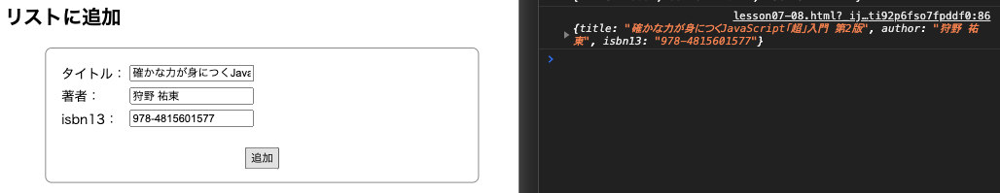

# レッスン8: 本棚アプリ
このレッスンでは、レッスン7で作った本棚アプリを仕上げます。

## 課題1

レッスン7の最後の課題では、本を追加することができるようになりました。

以降の課題でバリデーションをかけていきますが、まずはその準備として、本が追加されたタイミングで、入力欄をリセットしましょう。

実行例  
[実行例](movies/lesson08-01.mov)

[答え](samples/lesson08/lesson08-01.html)

## 課題2

課題1と同じものを、今度は、javascript内で`addEventListener`を使って実装してみてください。  
ただし、`<script>`タグ(javascript)は、`</head>`の**直前**に書きます。

実行例  
  


[答え](samples/lesson07/lesson07-02.html)

## 課題3

課題1か課題2のどちらかを以下のように改造してください。

* 名前を入力する欄を作る。
* 「おみくじを引く」ボタンを押したときに、入力した名前を表示する。

実行例  


[答え](samples/lesson07/lesson07-03.html)

## 課題4

レッスン6、課題1のHTMLにjavascriptを追加して、本をクリックしたときにコンソールに「クリックした」と表示してみましょう。  
クリックイベントは、HTMLに`onclick`を付加する方法で実装してください。

### ヒント

* コンソールに「クリックした」と表示する関数を`disp`という名前で定義しましょう。
* 複数の要素の`onclick`に、同一関数(disp)の実行を指定しても大丈夫です。

実行例  


[答え](samples/lesson07/lesson07-04.html)

## 課題5

課題4の出力では、何番目の本がクリックされたかわかりません。  
`disp`関数の引数に「何番目か」を表す`index`を定義し、`onclick`の中で呼び出すときに、引数に番号を渡してあげましょう。  
例えば、1番目の本をクリックしたときには、`disp(1)`が実行されるようにします。  
**注意： indexは0から数えてください。**

実行例  
  


[答え](samples/lesson07/lesson07-05.html)

## 課題6

**難問です。わからなければ遠慮せず答えを見て、先に進んでください。**

課題5では、直接HTMLに`<li>`要素を書き込んでいます。  
レッスン6の課題7をコピーして、これと同じようにjavascriptの中で`<li>`要素を追加し、  
なおかつ、上記課題5までと同じような動きになるように書き換えてみましょう。  
ただし、`<script>`タグ(javascript)は、`</head>`の**直前**に書きます。

`onclick`属性は、javascriptからも、以下のようにして設定することができます。  
（addEventListenerは引数を渡すのがとても難しいので、この方法を使います）

`onclick="disp(1)"`のようにしたいとき

```
<要素>.setAttribute('onclick', 'disp(1)');
```

### ヒント

* `for...of`を使うと`index`が取れないので、`for(let i = 0; i < books.length; i++) {}`を使いましょう。
* 本が3冊あるとき、`disp(1)`の`1`のところには、`0~2`の数字が入りますね。

実行例  
  


[答え](samples/lesson07/lesson07-06.html)

## 課題7

タイトルリストでクリックされた本の詳細を、画面下部に表示しましょう。  
選択された本の詳細を表示するエリアは、以下のようにマークアップしましょう。

```html
<h2>選択された本の詳細</h2>
<div id="selected-book">
    <h3 id="book-title"></h3>
    <div id="info">
        <p>著者: <span id="book-author"></span></p>
        <p>isbn13: <span id="book-isbn13"></span></p>
    </div>
</div>
```

### ヒント

* クリックされた本が何番目かは`index`でわかります。
* `#selected-book`に当たるCSSは`<li>`と同じです。複数要素に同じCSSを当てたい要素は、CSS内で、`要素, 要素`とカンマ区切りで並べて書くことができます。
* `#selected-book`は`<li>`と違って左側にマージンが取られません。`#selected-book`にCSS`margin-left: 50px;`を追加しましょう。
* 本のタイトルを中央揃えにするため、`#selected-book h3`にCSS`text-align: center;`を追加しましょう。

実行例  
  


[答え](samples/lesson07/lesson07-07.html)

## 課題8

本棚アプリに本を追加する機能をつけましょう。 -- 第1段階

1. 本の各情報の入力欄を作ります。
2. 「追加」ボタンを用意します。
3. 「追加」ボタンを押すと、その情報で本のオブジェクトを生成します。
4. 生成されたオブジェクトを、コンソールに表示しましょう。
5. HTML、CSSは下記のように書きましょう。

HTML:
```html
<h1>本棚</h1>
<h2>リストに追加</h2>
<div id="add">
    <table>
    <tr>
        <td>
            <label for="input-title">タイトル：</label>
        </td>
        <td>
            <input type="text" id="input-title">
        </td>
    </tr>
    <tr>
        <td>
            <label for="input-author">著者：</label>
        </td>
        <td>
            <input type="text" id="input-author">
        </td>
    </tr>
    <tr>
        <td>
            <label for="input-isbn13">isbn13：</label>
        </td>
        <td>
            <input type="text" id="input-isbn13">
        </td>
    </tr>
    </table>
    <button id="add-button" onclick="add()">追加</button>
</div>

<h2>一覧</h2>
<ul id="book-list"></ul>

<h2>選択された本の詳細</h2>
・・・以下省略
```

CSS:
```css
#book-list {
    list-style: none;
}

#book-list li, #selected-book, #add {
    width: 500px;
    border: solid 1px #808080;
    border-radius: 0.5em;
    margin: 10px;
    padding: 1em;
}

#book-list li:hover {
    background-color: #CECECE;
}

#selected-book, #add {
    margin-left: 50px;
}

#selected-book h3 {
    text-align: center;
}

#add {
    text-align: center;
}

#add table {
    margin-bottom: 20px;
}
```

### ヒント

* `addBook`という関数を用意しましょう。
* `.value`や、`onclick`をフル活用します。

実行例  
  


[答え](samples/lesson07/lesson07-08.html)

## 課題9

本棚アプリに本を追加する機能をつけましょう。 -- 第2段階

課題8で入力した内容をオブジェクトにするところまでできました。  
オブジェクト配列`books`に入力した本のオブジェクトを追加しましょう。  
配列に本を追加しても、表示は変わりません。  
表示を更新するために、関数`reflesh()`を呼びましょう。  
`window.onload`内に書いていた内容を関数`reflesh()`として切り出します。  
リスト表示を一度クリアするには、`<ul要素>.innerHTML = '':`を使います。

実行例  


[答え](samples/lesson07/lesson07-09.html)
