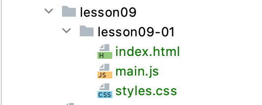
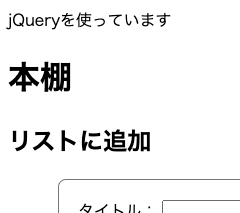
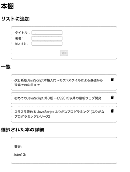

# レッスン9: 外部ファイル・ライブラリとjQuery
このレッスンでは、CSSとjavascriptの外部ファイル化と有名なライブラリであるjQueryについて学びます。

## 課題1

レッスン8で作り上げた本棚アプリを整理しましょう。

CSS部分を抜き出して、`styles.css`ファイルにします。  
javascript部分を抜き出して、`main.js`ファイルにします。  
また、HTMLファイルは、`index.html`という名前にします。

これらのファイルを`lesson09-01`というフォルダに入れます。

`index.html`に`styles.css`と`main.js`を呼び出すコード（タグ）を書きます。

`index.html`をブラウザで表示して、問題なく動くことを確認します。

### 実行例


[答え](samples/lesson09/lesson09-01)

## 課題2

jQueryを導入しましょう。

jQueryは、DOMを操作することに長けたjavascriptライブラリです。  
ダウンロードして簡単に使うことができます。

`lesson09-01`フォルダをコピーして、`lesson09-02`フォルダを作ります。
[こちら](https://jquery.com/download/)から`uncompressed`をダウンロードして、`lesson09-02`フォルダに入れます。

`index.html`にjQueryを読み込むコード（タグ）を書き、`index.html`と`main.js`を以下のように変更します。

```html
<!-- 略 -->
<body>
<p id="box"></p> <!-- この行を追加 -->
<h1>本棚</h1>
<!-- 略 -->
```

```javascript
// ・・・略・・・

// 以下の3行を追加
$(() => {
  $('#box').html('jQueryを使っています');
});

window.onload = () => {
  refresh();
};
```

### 実行例


[答え](samples/lesson09/lesson09-02)

## 課題3

`lesson09-02`フォルダをコピーして、`lesson09-03`フォルダを作ります。

`index.html`の、課題2で追加したコードを削除します。

```html
<!-- 略 -->
<body>
<p id="box"></p> <!-- この行を削除 -->
<h1>本棚</h1>
<!-- 略 -->
```

`main.js`のほうも、課題2で追加したコード（一部）を削除します。

```javascript
// ・・・略・・・

$(() => {
  $('#box').html('jQueryを使っています'); // この行のみ削除
});

window.onload = () => {
  refresh();
};
```

では、`main.js`をjQueryを使ったものに書き換えましょう。

レッスン8の最後と同じ動きをするようになればOKです。

### 実行例



[答え](samples/lesson09/lesson09-03)
