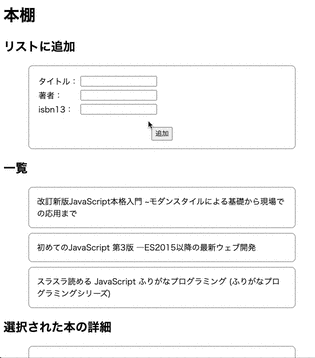
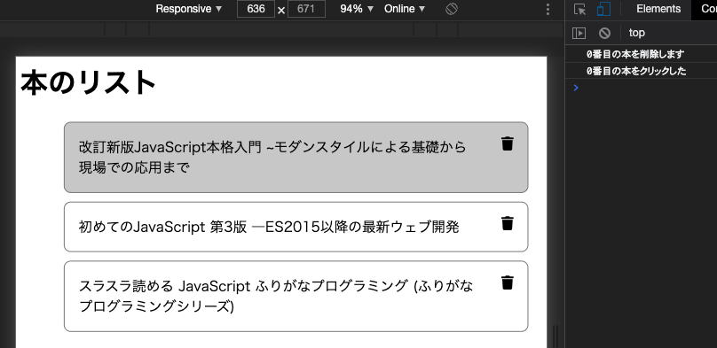
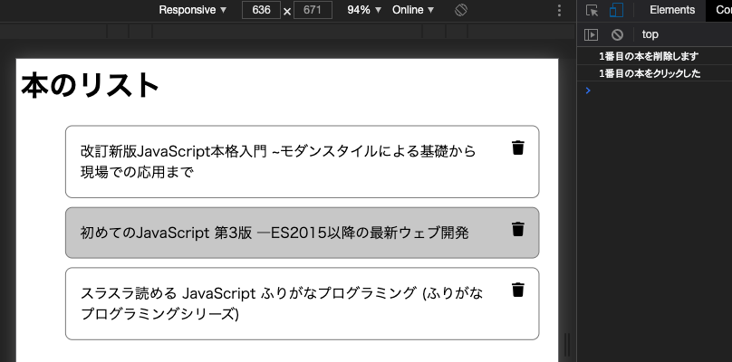
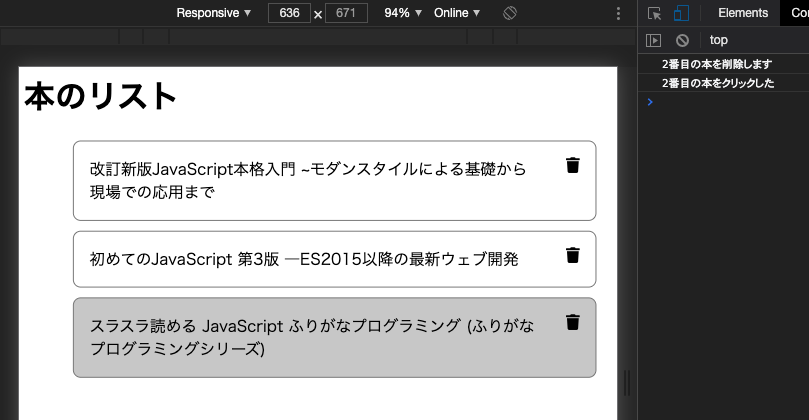

# レッスン9: 外部ファイル・ライブラリとjQuery
このレッスンでは、CSSとjavascriptの外部ファイル化と有名なライブラリであるjQueryについて学びます。

## 課題1

レッスン8で作り上げた本棚アプリを整理しましょう。

CSS部分を抜き出して、`styles.css`ファイルにします。  
javascript部分を抜き出して、`main.js`ファイルにします。  
また、HTMLファイルは、`index.html`という名前にします。

これらのファイルを`lesson09-01`というフォルダに入れます。

`index.html`に`styles.css`と`main.js`を呼び出すコード（タグ）を書きます。

`index.html`をブラウザで表示して、問題なく動くことを確認します。

### 実行例


[答え](samples/lesson09/lesson09-01)

## 課題2

jQueryを導入しましょう。

jQueryは、DOMを操作することに長けたjavascriptライブラリです。  
ダウンロードして簡単に使うことができます。

`lesson09-01`フォルダをコピーして、`lesson09-02`フォルダを作ります。
[こちら]()から`uncompressed`をダウンロードして、`lesson09-02`フォルダに入れます。

`index.html`にjQueryを読み込むコード（タグ）を書き、`index.html`と`main.js`を以下のように変更します。

```html
<!-- 略 -->
<body>
<p id="box"></p> <!-- この行を追加 -->
<h1>本棚</h1>
<!-- 略 -->
```

```javascript
// ・・・略・・・

// 以下の3行を追加
$(() => {
  $('#box').html('jQueryを使っています');
});

window.onload = () => {
  refresh();
};
```

### 実行例


[答え](samples/lesson09/lesson09-02)

## 課題3

課題2では、バリデーションを実装しましたが、コンソールにエラーメッセージを表示する方法は、ユーザフレンドリーではありませんね。  
エラーメッセージを表示する欄を設けて、バリデーションに引っかかったときは、そこにメッセージを表示するようにしましょう。

エラーメッセージを表示する欄は、次のようにマークアップします。

```html
<tr>
    <td>
        <label for="input-title">タイトル：</label>
    </td>
    <td>
        <input type="text" id="input-title">
    </td>
    <!-- 以下を追加 -->
    <td class="error">
        <span id="error-title"></span>
    </td>
</tr>
```

`error`クラスに対して文字色を赤にするCSSも書いてみましょう。

また、一度エラーメッセージを表示したあとに、正しく入力が行われた場合、エラーメッセージを消さないといけません。  
これは、`validate`関数のはじめの方に書くといいでしょう。

### 実行例



[答え](samples/lesson08/lesson08-03.html)

## 課題4

課題3では、追加ボタンを押したタイミングでバリデーションを行いました。

最近のWebシステムでは、「入力ミスがあるとそもそも追加ボタンが押せない」という仕様がほとんどです。  
この本棚アプリにもその仕様を実装してみましょう。

###実行例


### ヒント

* 「ボタンを押せない」というのは、ボタンの`disabled`プロパティを`true`にすることで実装できます。
* HTMLが読み込まれた時点では「追加」ボタンは`disabled`です。  これはHTMLに直接書くのが手っ取り早いでしょう。  `<button ~ disabled>`のように書きます。
* それぞれの入力欄に入力された内容が変化するたびに`validate()`を実行します。
* `input`要素の入力が変化したことを検知する属性は`onchange`です。`onchange="入力が変化したときに実行したい関数"`と書きます。
* `validate`内で、`return false;`する直前、つまりバリデーションに引っかかったタイミングで、ボタンの`disabled`プロパティを`true`にします。
* `validate`内で、`return true;`する直前、つまりバリデーションがすべて通ったタイミングで、ボタンの`disabled`プロパティを`false`（ボタンが押せるようになる）にします。
* `refresh`の最後でも、ボタンの`disabled`プロパティを`true`にします。

[答え](samples/lesson08/lesson08-04.html)

## 課題5

リストの中に削除アイコンを表示するためのHTMLを作成しましょう。

1. レッスン7課題5のコードをコピーします。
2. `li`要素の中を膨らませます。`li`直下に`div`要素を作成し、`div`直下に2つの`span`を置きます。
3. 1つ目の`span`は、タイトルを入れます。2つめの`span`には削除アイコンを入れます。
4. 削除アイコンは、`<i class="fas fa-trash"></i>`とマークアップします。
5. 削除アイコンをクリックすると、`remove(index)`という関数が実行されます。indexは0~2の数字です。関数も定義してください。中身は「index番目の本を削除します」というコンソール表示のみでOKです。
6. アイコンを表示するための「Font Awesome」というライブラリを読み込みます。`head`内に以下のコードを挿入します。

```html
<link rel="stylesheet" href="https://cdnjs.cloudflare.com/ajax/libs/font-awesome/5.11.2/css/all.min.css">
```

「Font Awesome」ライブラリの詳しい説明は、[ここ](https://dev.to/weeb/font-awesome-guide-and-useful-tricks-you-might-ve-not-known-about-until-now-o15)あたりを読むといいでしょう。  
アイコン一覧は[ここ](https://fontawesome.com/icons?d=gallery&m=free)にあります。`delete`で検索してみましょう。

次に、レイアウトを整えます。

まず、`div`要素に`d-flex`というclassをつけて、そのクラスを使ってCSSをあてましょう。  
`div`の中で要素を横並びにするには、`div`要素に次のようなCSSをあてます。

```css
.d-flex {
    display: flex; /* 子要素を横並びにする */
    justify-content: space-between; /* 子要素は間に等分のスペースを取る */
}
```

タイトル部がゴミ箱のアイコンと近すぎるので、タイトルの右側に2文字ぶんのマージンを取りましょう。  
タイトル部（1つめの`span`）には、`book-title`というクラスをつけましょう。

```css
.book-title {
    margin-right: 2rem;
}
```

実行例  
  



[答え](samples/lesson08/lesson08-05.html)

## 課題6

`要素.innerHTML`の右辺には、長ーいHTMLを入れることもできます。  
長いHTMLを入れるときは、テンプレートリテラルを使うと便利です。  
テンプレートリテラルは、途中で改行することもできます。

```javascript
element.innerHTML = `
    <div>
      <span>
      </span>
    </div>
`;
```
このようなこともできます。  
まるで普通にHTMLを書いているような気分になりますね。

さて、課題4と課題5をうまく組み合わせて、`ul`要素の中身をプログラムを使って作成してください。
レッスン7の課題6が参考になるでしょう。

`span`要素への`onclick`属性の追加は、`setAttribute`を使わなくても書けます。

実行例

課題5と同じです。  


[答え](samples/lesson08/lesson08-06.html)

## 課題7

`remove`関数の中身を実装して、実際に本が削除できるようにしましょう。

実行例  


### ヒント

* クリックされた本が何番目かは`index`でわかります。
* 配列からindex番目の要素を削除するには、`配列.splice(index, 1)`と書きます。

[答え](samples/lesson08/lesson08-07.html)
