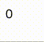
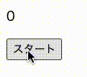
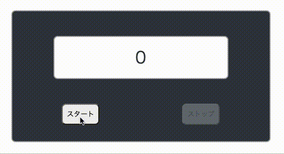
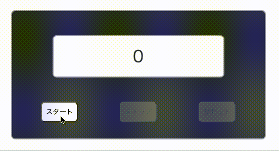

# レッスン10: タイマー

このレッスンでは、一定時間ごとに関数を実行する方法を学びます。

## 課題1

まず画面に0を表示し，1秒ごとにカウントアップしましょう。

※ タイマーを止める機能がないので，止めるにはブラウザのタブを閉じてください。

### 実行例

[答え](samples/lesson10/lesson10-01)

### HINT

setTimeOut

## 課題2

以下のようなタイマーアプリを作りましょう。

1. まず画面にスタートボタンと0を表示します。
2. スタートボタンを押すと1秒ごとにカウントアップを始めます。このとき，スタートボタンは押せない状態にします。

※ タイマーを止める機能がないので，止めるにはブラウザのタブを閉じてください。

### 実行例

[答え](samples/lesson10/lesson10-02)

## 課題3

以下のようなタイマーアプリを作りましょう。

1. まず画面にスタートボタン，ストップボタンと0を表示します。このとき，スタートボタンは押せる状態，ストップボタンは押せない状態にします。
2. スタートボタンを押すと1秒ごとにカウントアップを始めます。このとき，スタートボタンは押せない状態，ストップボタンは押せる状態にします。
3. ストップボタンを押すとその数字で止まります。このとき，スタートボタンは押せる状態，ストップボタンは押せない状態にします。
4. スタートボタンを押すとその数字から再びカウントアップが始まります。2の状態に戻ります。

デザインは`style.css`に書いてあります。お好みで書き換えてください。

※ タイマーを0にする機能がないので，0に戻すにはブラウザのタブをリロードしてください。

### 実行例

[答え](samples/lesson10/lesson10-03)

## 課題4

以下のようなタイマーアプリを作りましょう。

1. まず画面にスタートボタン，ストップボタン，リセットボタンと0を表示します。このとき，スタートボタンは押せる状態，ストップボタンとリセットボタンは押せない状態にします。
2. スタートボタンを押すと1秒ごとにカウントアップを始めます。このとき，スタートボタンとリセットボタンは押せない状態，ストップボタンは押せる状態にします。
3. ストップボタンを押すとその数字で止まります。このとき，スタートボタンとリセットボタンは押せる状態，ストップボタンは押せない状態にします。
4. スタートボタンを押すとその数字から再びカウントアップが始まります。2の状態に戻ります。
5. 3の状態のあと，リセットボタンを押すと数字が0に戻り，1の状態になります。

デザインは`style.css`に書いてあります。お好みで書き換えてください。

### 実行例

[答え](samples/lesson10/lesson10-04)
