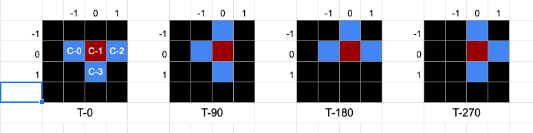

# レッスン12: 配列とブロック

> このレッスン内で言う「座標」とは，以下のようなx方向のセル位置，y方向のセル位置を指します。

このレッスンでは、配列を使って4つのセルが組み合わさったブロックを作ります。
ブロックのデータをひとまとめにして，オブジェクトにします。
例えばT型のブロック`BLOCK_T`は次のように表します。

```js
const BLOCK_T = {
  color: '#63c9ff',
  shape: [
    [[-1, 0], [0, 0], [1, 0], [0, 1]],
    [[-1, 0], [0, 0], [0, -1], [0, 1]],
    [[-1, 0], [0, 0], [1, 0], [0, 1]],
    [[0, -1], [0, 0], [0, 1], [1, 0]]
  ]
}
```



`shape`は3重の配列になっています。
いちばん外側の配列には4つの要素が入っていて，それぞれ，以下の4つの「向き」を表しています。

```
shape: [T-0, T-90, T-180, T-270]
```

その内側の配列には，4つの要素が入っていて，それぞれ，1つのブロックの，4つのセルの位置を表しています。
例えば，上記の`T-0`は以下のように表されます。

```
[c-0, c-1, c-2, c-3]
```

いちばん内側の配列には，2つの要素が入っていて，それぞれ，1つのセルの， `x`座標と`y`座標を表しています。
この座標は，`(0, 0)`のブロックが，`(posX, posY)`の位置に表示されることを表しています。
例えば，上記の`c-0`は以下のように表されます。

```
[-1, 0]
```

※ `index.html`や`style.css`はすでに書いてあります。`main.js`を記述しましょう。

## 課題1

ブロックを描画する関数`drawBlock`を作成しましょう。

引数:
* x座標を表すcol
* y座標を表すrow
* 向きを表すdirection
* ブロックを表すtype（オブジェクト）

戻り値:
* なし

また，`drawCell`の代わりに`drawBlock`を使い，セルの代わりにブロックが描画されるようにしましょう。

### 実行例


### HINT

ブロックを構成する4つのセルの1つ1つを，`drawCell`を使って描画します。

赤いブロックの位置`(posX, posY)`及び`(col, row)`が`(6, 2)`で，ブロックの向きがいちばん右の向き（ト型）のとき，4つのセルのx座標，y座標は以下のように計算できます。
```
// 向きは3番目(T-270)なのでshape[3]を使う
// 0番目のセル(C-0) -> shape[3][0]
(6 + type.shape[3][0][0], 2 + type.shape[3][0][1]) // -> (6, 1)

// 1番目のセル(C-1) -> shape[3][1]
(6 + type.shape[3][1][0], 2 + type.shape[3][1][1]) // -> (6, 2)

// 2番目のセル(C-2) -> shape[3][2]
(6 + type.shape[3][2][0], 2 + type.shape[3][2][1]) // -> (6, 3)

// 3番目のセル(C-3) -> shape[3][3]
(6 + type.shape[3][3][0], 2 + type.shape[3][3][1]) // -> (7, 2)
```

これを`for`文や引数を使って表現してみましょう。

[答え](samples/lesson11/lesson11-01)

## 課題2

1. グローバル変数`direction`を宣言して初期値に0を代入します。
2. 右側の回転ボタン，Eキー，Xキーで時計回りに回転するようにしましょう。
3. 左側の回転ボタン，Qキー，Zキーで反時計回りに回転するようにしましょう。
4. 時計回りに回転する関数は，`rotateClockwise`，反時計回りに回転する関数は`rotateCounterClockwise`とします。これら2つの関数も作成しましょう。

> `index.html`に回転ボタンを追加しています。

### 実行例


### HINT

`rotateClockwise`関数や`rotateCounterClockwise`は`moveLeft`や`moveRight`と同じ要領で作ります。
すなわち，次の向きや位置で`canMoveTo`関数の返り値を判定し，移動（回転）可能であれば実際に値を変えてブロックを再描画します。

時計回りに向きを変えるには，ブロックの`shape`配列のインデックスを`1`増やします。
ただし，`0`→`1`→`2`→`3`のあと，`1`増やすと`4`になり，インデックスが配列からはみ出してしまいます。
これを防ぐためには，増やした値を`4`で割った余りを使います。
そうすると，必ず`0`〜`3`の値になります。

```js
const nextDirection = (direction + 1) % 4;
```

同じ処理は`if`文を使っても書けますが，上記のほうがスマートです。

```js
let nextDirection = direction + 1; // これだと direction が 3 のときには次が 4 になってしまう
if(nextDirection >= 4) {
  nextDirection -= 4;
}
````

> `-1 % 4 = -1`となるため，反時計回りのときは，インデックスを`1`減らすのではなく，`3`増やすと考えましょう。

### TIPS
HINTで挙げたインデックスの処理方法において，前者が後者より優れている理由は行数が少ないだけではありません。
後者の場合，`if`文を書く必要があるため，次の向きを「式」として表すことができず，`nextDirection`を変更可能な変数としてしか宣言できません。
しかし，前者は計算結果を返す「式」なので，定数として宣言したり，`canMoveTo`の引数に埋め込んだりできます。

[答え](samples/lesson11/lesson11-01)

## 課題3

関数`canMoveTo`に回転可能であるかの判定を加えましょう。

1. 引数に向きを表す`direction`を追加します。
2. 引数で指定された位置と向きにおける`BLOCK_T`のすべてのセルがエリアからはみ出さないかをチェックします。

### 実行例


### HINT

向きが`direction`である`BLOCK_T`を構成する4つのセルをすべてチェックするには，以下のような`for`文を利用します。

```
for(const position of BLOCK_T.shape[direction]) {
  // positionにはブロックの情報が入っている（ループするごとに順に0番目〜3番目までの4つのセルを指す）
  // col + position[0]がセルのx座標
  // row + position[1]がセルのy座標
}
```

[答え](samples/lesson11/lesson11-01)

## 課題4

ブロックの種類を7つに増やしましょう。

ブロックのデータは見やすさや変更しやすさを考慮して，`block-type.js`というファイルに分けました。
まずは，このファイルを`index.html`内で`main.js`より**先に**読み込みましょう。順番が逆だとうまくいきません。

次に，`main.js`内で`blockType`というグローバル変数を宣言し，初期値として`BLOCK_S`を代入します。

最後に`main.js`内で`BLOCK_T`と固定値でコーディングしていた部分を`blockType`変数を参照するように変更しましょう。

うまく動いたら，`blockType`の初期化部で代入するブロックの種類を色々変えて，ブロックがきちんと変わるか見てみましょう。

### 実行例


### HINT

`main.js`内の`BLOCK_T`を`blockType`に置き換える際は，エディタやIDEの**置換機能**などを利用しましょう。

[答え](samples/lesson11/lesson11-01)


## 課題5

出てくるブロックの向きと種類をランダムにしてみましょう。

ブロックのすべての種類を配列`BLOCKS`に格納して，`block-type.js`に追記しました。
`blockType`を初期化するときに，配列`BLOCKS`の要素からランダムに選ぶようにしましょう。

### 実行例


### HINT

0〜3のランダムな数を取得するには

```
Math.floor(Math.random() * 4);
```

と書きます。`3`ではなく`4`であるところがポイントです。

また，配列の要素数は`配列.length`で得られます。

[答え](samples/lesson11/lesson11-01)
